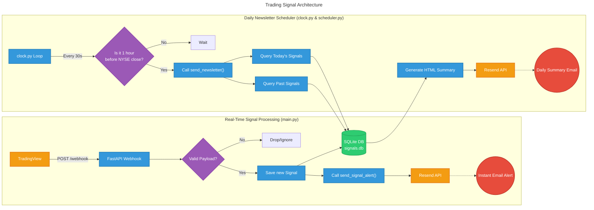

```mermaid
---
title: Trading Signal Architecture
---
graph LR
    %% Define Styles
    classDef external fill:#f39c12,stroke:#e67e22,stroke-width:2px,color:white;
    classDef process fill:#3498db,stroke:#2980b9,stroke-width:2px,color:white;
    classDef database fill:#2ecc71,stroke:#27ae60,stroke-width:2px,color:white;
    classDef decision fill:#9b59b6,stroke:#8e44ad,stroke-width:2px,color:white;
    classDef email fill:#e74c3c,stroke:#c0392b,stroke-width:2px,color:white;

    %% Shared Database
    DB[(SQLite DB<br>signals.db)]:::database

    subgraph RealTime ["Real-Time Signal Processing (main.py)"]
        direction TB
        TV[TradingView]:::external -->|POST /webhook| Webhook[FastAPI Webhook]:::process
        Webhook --> Validate{Valid Payload?}:::decision
        Validate -->|No| Ignore[Drop/Ignore]
        Validate -->|Yes| SaveDB[Save new Signal]:::process
        SaveDB --> DB
        SaveDB --> SendAlert["Call send_signal_alert()"]:::process
        SendAlert --> Resend1[Resend API]:::external
        Resend1 -.-> Email1((Instant Email Alert)):::email
    end

    subgraph Scheduler ["Daily Newsletter Scheduler (clock.py & scheduler.py)"]
        direction TB
        Clock[clock.py Loop]:::process -->|Every 30s| CheckTime{"Is it 1 hour <br>before NYSE close?"}:::decision
        CheckTime -->|No| Wait[Wait]
        CheckTime -->|Yes| Trigger["Call send_newsletter()"]:::process
        Trigger --> QueryToday["Query Today's Signals"]:::process
        Trigger --> QueryPast[Query Past Signals]:::process
        QueryToday --> DB
        QueryPast --> DB
        DB --> BuildHTML[Generate HTML Summary]:::process
        BuildHTML --> Resend2[Resend API]:::external
        Resend2 -.-> Email2((Daily Summary Email)):::email
    end
```