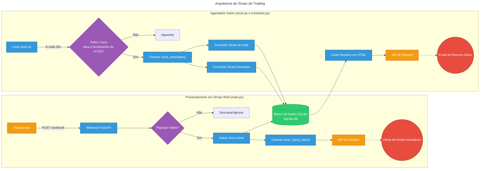

```mermaid
---
title: Arquitetura de Sinais de Trading
---
graph LR
    %% Definir Estilos
    classDef external fill:#f39c12,stroke:#e67e22,stroke-width:2px,color:white;
    classDef process fill:#3498db,stroke:#2980b9,stroke-width:2px,color:white;
    classDef database fill:#2ecc71,stroke:#27ae60,stroke-width:2px,color:white;
    classDef decision fill:#9b59b6,stroke:#8e44ad,stroke-width:2px,color:white;
    classDef email fill:#e74c3c,stroke:#c0392b,stroke-width:2px,color:white;

    %% Banco de Dados Compartilhado
    DB[(Banco de Dados SQLite<br>signals.db)]:::database

    subgraph RealTime ["Processamento em Tempo Real (main.py)"]
        direction TB
        TV[TradingView]:::external -->|POST /webhook| Webhook[Webhook FastAPI]:::process
        Webhook --> Validate{Payload Válido?}:::decision
        Validate -->|Não| Ignore[Descartar/Ignorar]
        Validate -->|Sim| SaveDB[Salvar Novo Sinal]:::process
        SaveDB --> DB
        SaveDB --> SendAlert["Chamar send_signal_alert()"]:::process
        SendAlert --> Resend1[API do Resend]:::external
        Resend1 -.-> Email1((Alerta de Email Instantâneo)):::email
    end

    subgraph Scheduler ["Agendador Diário (clock.py e scheduler.py)"]
        direction TB
        Clock[Loop clock.py]:::process -->|A cada 30s| CheckTime{"Falta 1 hora<br>para o fechamento da NYSE?"}:::decision
        CheckTime -->|Não| Wait[Aguardar]
        CheckTime -->|Sim| Trigger["Chamar send_newsletter()"]:::process
        Trigger --> QueryToday["Consultar Sinais de Hoje"]:::process
        Trigger --> QueryPast["Consultar Sinais Passados"]:::process
        QueryToday --> DB
        QueryPast --> DB
        DB --> BuildHTML[Gerar Resumo em HTML]:::process
        BuildHTML --> Resend2[API do Resend]:::external
        Resend2 -.-> Email2((Email de Resumo Diário)):::email
    end
```